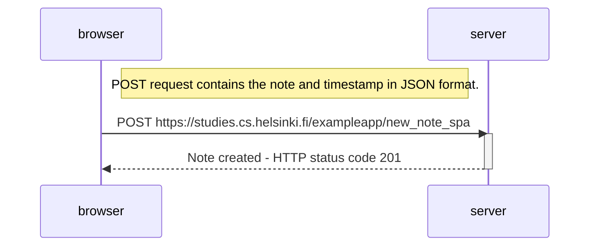

Sequence diagram for creating a new note in  the single page web application version as described here: https://fullstackopen.com/en/part0/fundamentals_of_web_apps#forms-and-http-post

The event handler replaces the form submit functionality.  This creates a new note, adds it to the notes list, rerenders the note list on the page and sends the new note to the server.